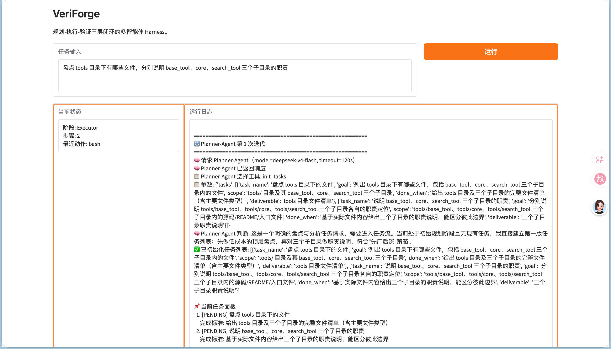
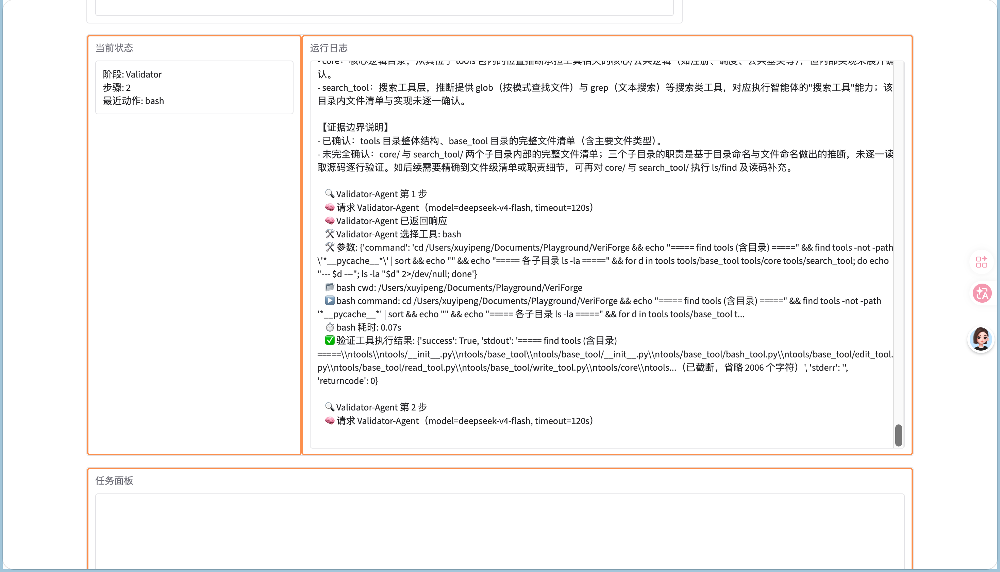
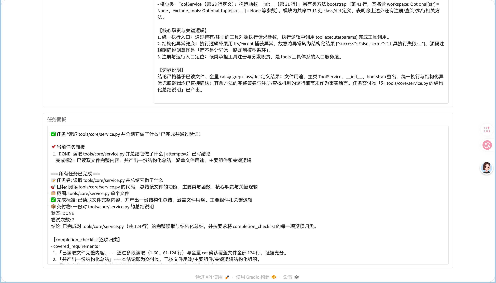

# VeriForge

**面向私有化大模型的多智能体 Harness** · 规划-执行-验证闭环 · 结构化动作协议 · 动态工作记忆

## 项目定位

VeriForge 是我在 InfraCoder（单 Agent 工具链）基础上迭代的升级项目。它保留了对本地 vLLM 和云端 OpenAI-Compatible API 的兼容，但把 Agent 从"单层工具循环"升级为"多智能体编排系统"。

核心差异：

| | InfraCoder | VeriForge |
|--|-----------|-------------|
| 循环层级 | 单层 ReAct 循环 | 三层嵌套：Planner → Executor → Validator |
| 任务管理 | 消息历史即状态 | ToDoList 任务看板 + 显式状态机 |
| 完成判定 | 模型说完成就完成 | Validator 独立验证后才算完成 |
| 失败处理 | 模型自行发现修正 | 验证失败 → 反馈回流 → 强制重试 |
| 记忆管理 | 单份上下文压缩 | 分角色工作记忆 + 重试归档 |

## 环境要求

- Python 3.10+（推荐 3.11）
- 一个可用的 OpenAI-Compatible API（DeepSeek / OpenAI / 本地 vLLM 均可）
- 支持原生 function calling 的模型（如 deepseek-v4-flash、gpt-4o-mini）

## 快速开始

```bash
# 1. 获取项目
git clone <你的仓库地址> VeriForge
cd VeriForge

# 2. 创建虚拟环境并安装依赖
python3.11 -m venv venv
source venv/bin/activate
pip install --upgrade pip
pip install -r requirements.txt

# 3. 配置模型
cp .env.example .env
```

编辑 `.env`：

```bash
# openai 兼容的 API KEY
API_KEY=你的key

# API 地址
BASE_URL=https://api.deepseek.com

# 模型名（必须支持 function calling）
MODEL_NAME=deepseek-v4-flash

# 单次模型请求超时（秒）
LLM_TIMEOUT_SECONDS=120

# 最大 Token 数
MAX_TOKENS=8192

# LangSmith 追踪（可选，默认关闭）
LANGCHAIN_TRACING_V2=false
```

如果使用本地 vLLM，改成：

```bash
BASE_URL=http://127.0.0.1:8000/v1
MODEL_NAME=你的模型名
API_KEY=EMPTY
```

## 命令行运行

```bash
python3 main_agent.py
```

程序会提示输入任务：

```
请输入你的任务/查询:
```

输入一个任务，比如：

```
读取 tools/core/service.py 并总结它做了什么
```

运行流程：

- **Planner-Agent** 先规划任务
- **Executor-Agent** 执行并提交结论
- **Validator-Agent** 独立验证，通过后任务标记 DONE
- 完整日志实时打印，最终结论在输出末尾

## Web UI

基于 Gradio 提供可视化界面，实时展示三层智能体的运行过程。

```bash
# 安装 Web UI 依赖（首次）
pip install gradio

# 启动
python3 webui.py
```

浏览器访问 `http://127.0.0.1:7861`。

界面包含三个面板：

- **当前状态**：实时显示当前阶段（Planner / Executor / Validator）、当前步骤、最近动作
- **运行日志**：实时逐行追加每次模型调用、工具调用和验证结果
- **任务面板**：任务结束后展示 DONE / FAILED / BLOCKED 状态与结论


*Executor 执行过程*


*Validator 独立验证*


*任务完成与结论*

## 架构

```
┌──────────────────────────────────────────────────────┐
│  Engine 编排层                                        │
│  Planner-Agent（全局调度）                             │
│    ├── init_tasks / add_task / split_task             │
│    ├── retry_task / subagent_tool / respond_to_user   │
│    └── 只读侦察（read / glob / grep）                  │
│                                                      │
│  Executor-Agent（任务执行）                            │
│    ├── 逐步取证（bash / read / write / edit / search） │
│    ├── completion checklist 驱动收口                  │
│    └── update_task_conclusion 提交结论                 │
│                                                      │
│  Validator-Agent（独立验证）                           │
│    ├── 补充核查（read / glob / grep / bash）           │
│    └── validate_tool 判定有效 / 无效                   │
└──────────────────────────────────────────────────────┘
            │
┌───────────▼──────────────────────────────────────────┐
│  状态与记忆层                                         │
│  ToDoList（PENDING/RUNNING/DONE/FAILED/BLOCKED）      │
│  WorkingMemory（分角色视图 + 压缩 + 重试归档）          │
├──────────────────────────────────────────────────────┤
│  动作协议层                                           │
│  native function call + schema 校验 + 多动作解码      │
├──────────────────────────────────────────────────────┤
│  工具层                                               │
│  ToolService → BaseTool → bash/read/write/edit/      │
│                            glob/grep                 │
└──────────────────────────────────────────────────────┘
```

## 核心设计

### 1. 三层智能体编排

- **Planner-Agent** 负责把用户需求拆成任务，不直接改文件
- **Executor-Agent** 负责取证和执行，但不能宣布任务完成
- **Validator-Agent** 负责独立验证结论是否被证据支持，不能代做任务

"看起来完成"与"真的完成"由 Validator 区分，这是闭环的核心价值。

### 2. 结构化动作协议

所有 Agent 通过原生 function call 与系统交互，而不是手写 XML 或自由文本。协议层统一完成：

- 把动作策略转换成 OpenAI tools 定义
- 解析模型返回的 function call
- 根据角色策略校验动作合法性

这样模型输出不是"看起来像工具调用"的文本，而是真正可被程序直接解析、验证、执行的结构化动作。

### 3. 动态工作记忆

- 工具结果写入记忆前先按类型压缩（read 保留片段、grep 保留命中预览、bash 保留输出）
- 记忆超限时把早期步骤压成确定性摘要，只保留最近几步完整轨迹
- Planner / Executor / Validator 各自维护独立的记忆视图
- 失败经验归档进 retry archive，下次重试直接复用

### 4. 受控任务状态机

任务状态迁移只能通过显式状态机：Runner 按 `PENDING -> RUNNING -> DONE/FAILED/BLOCKED` 推进，`retry_task` 只能把 `FAILED/BLOCKED` 恢复为 `PENDING`，Planner 不能直接改状态。

## 模型适配

项目默认适配 DeepSeek 等 OpenAI-Compatible 后端，额外做了两层兼容：

- `tool_choice="required"` 不被支持时自动降级为 `auto`
- 模型一次返回多个 function call 时逐个解码、执行，不丢动作

## 常见问题

### Q: 报错 `Thinking mode does not support this tool_choice`

项目已内置兼容处理：检测到该错误会自动把 `tool_choice` 从 `required` 降级为 `auto` 重试，无需手动处理。

### Q: 报错 `Insufficient Balance` / 401 / 404

检查 `.env` 里的 API_KEY、BASE_URL、MODEL_NAME 是否正确，模型名必须支持 function calling。

### Q: 任务 600 秒还没跑完

在 `domain/types.py` 的 `AgentRuntime` 中调整预算：

```python
max_plan_iterations: int = 8      # Planner 最大轮数
max_generator_steps: int = 20     # Executor 单任务最大步数
max_validate_steps: int = 8       # Validator 最大步数
max_task_retries: int = 3         # 任务最大重试次数
max_total_runtime_seconds: int = 600  # 总运行预算
```

### Q: 模型一次返回多个 function call

项目已支持多动作解码：一次返回多个 read/bash 时会逐个执行并写入工作记忆，不会丢弃。

## 项目结构

```
VeriForge/
├── main_agent.py          # 命令行入口
├── webui.py               # Gradio Web 界面（实时状态 + 日志 + 任务面板）
├── bootstrap/             # 运行时装配（client / 工具 / 记忆 / 任务）
├── engine/                # 三层编排：main_loop / runner / validator
├── llm/
│   ├── runner.py          # 统一模型调用入口
│   └── prompting/         # Prompt 构造 / 动作策略 / function call 协议
├── domain/                # Task / ToDoList / 状态机
├── memory/                # WorkingMemory / SessionMemory / 视图渲染
├── tools/
│   ├── core/              # BaseTool / ToolSpec / ToolService
│   ├── base_tool/         # bash / read / write / edit
│   └── search_tool/       # glob / grep
├── skills/                # 可查询的 skill 仓库
└── use_case/              # 使用示例与运行日志
```

## 使用示例

```bash
# 示例：分析 memory 目录是否真的有用
python3 main_agent.py
# 输入：请判断当前项目里的 memory 目录是否真的有用，说明各组件作用……

# 示例：读取并总结某个文件
python3 main_agent.py
# 输入：读取 tools/core/service.py 并总结它做了什么
```

完整运行日志见 `use_case/case3/log.txt`，最终结果见 `use_case/case3/res.md`。

## 致谢

本项目在 [datawhalechina/self-harness](https://github.com/datawhalechina/self-harness) 的教学架构基础上迭代，结合私有化模型部署场景解决了 DeepSeek 后端的工具调用兼容问题，并针对长任务执行补充了并行动作解码与记忆截断优化。
